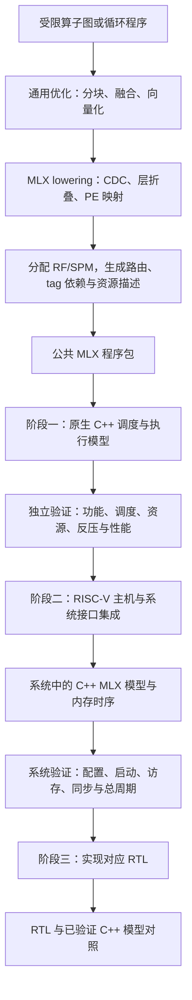

# 参考 GPGPU 编译链与两级调度，补齐 MLX 系统模拟器

日期：2026-09-07。状态：实施中；原生 C++ 模拟器与登记编译负载通过[第一阶段验收](../artifacts/tagged/stage1-acceptance/certificate.json)，C++ 模型的 Chipyard 集成通过[第二阶段验收](../artifacts/tagged/stage2-acceptance/certificate.json)。M4 已开始，单 PE 控制/共享 RF 前端通过组件检查；完整功能 RTL、系统对照与 PPA 尚未完成，详见[RTL 实施状态](mlx-tagged-rtl-progress.md)。

实施顺序（2026-09-07 用户明确）：**先修改原生 C/C++ 模拟器来模拟 GPU 式调度机制 → 再进行系统模拟集成 → 最后进行 RTL 实现。** 编译链随模拟器共同完善；Python 仅作输入编译、参考和审计辅助。各阶段必须先满足退出条件，才能推进下一阶段，不能因 Chipyard 的可用性或存在旧 RTL 而提前修改电路。实际进展见[原生 C++ 模拟器实施状态](mlx-native-simulator-progress.md)。

新增硬门槛（2026-09-07 用户补充）：**以 MLX 所用完整模型在模拟器中的端到端推理结果验证系统正确性；每个模型算子都有实际编译路径，正确性通过后才验证推理性能。** 当前优先补齐这一模型级 C++/系统链路，暂停继续扩展 RTL/PPA。已有 M3 证书仅覆盖接口与登记小负载，不是模型级通过；详细模型身份、覆盖规则和 ME0–ME4 条件见[模型级验证方案](mlx-model-e2e-validation.md)。

最新模型后端增量：矩阵、浮点向量、[数据搬运](mlx-memory-control-plans.md)与控制均提供响应驱动的C++周期入口。公开Llama2的6181个源调用已逐节点编译为870 matrix、2622 vector、2659 memory、30 control；旧功能入口不能作为缺失lowering的回退。[共享原生物理执行器](mlx-shared-physical-model.md)已连接同一地址空间、pin生命期、写入有效位和单调时钟，通过组合生成/扰动/重试回归；控制仍不是完整Rocket CPU，跨算子仍串行。真实主机装载/访存/ABI、共享RF/SPM/CDC与新路径完整模型执行尚待完成，不能用组件周期、编译覆盖或历史数值一致性单独放行推理性能。

系统准备增量（2026-09-08）：[通用C/RV64任务调度器](mlx-generic-host-dispatch.md)已在登记生成图实际混合执行控制、矩阵、向量、搬运与合法视图消除；[C++稀疏测试内存](mlx-sparse-mapped-memory.md)支持大窗口中的实际高偏移字节访问，保持旧用例的事件/周期不变。完整模型资产装载、真实CPU/设备时钟及Rocket/HellaCache仍未完成，这些接口回归不放行模型系统验收、性能或RTL。

装载入口继续补齐：[只读文件输入区与实际CPU复制](mlx-file-asset-loading.md)已在正常/扰动生成图保持执行结果一致，源文件偏移和目标内存均使用64-bit地址，计算前逐资产核对目标摘要。完整公开Llama2的360资产、13476831558 bytes已由实际CPU装载并全部核对通过；这不代替完整模型计算、原GPU误差核对或真实系统时序验收。

时钟/访存增量：[外部边沿驱动的C++设备控制器](mlx-clocked-device-controller.md)现已通过[实际Rocket/RoCC连接](mlx-clocked-rocc-integration.md)运行正常/权重扰动45节点图及3个阻塞WAIT联合链。期间修正HellaCache窄store数据展开错误，159项相关回归通过；cache重放由本地SimpleHellaCacheIF负责。该阶段使用256MiB配置和登记图，不把这些结果计为完整模型M3或性能通过。

大地址空间继续补齐：[独立16GiB配置](mlx-wide-system-memory.md)已通过实际高地址生成图，SV/DPI地址保持64-bit并显式检查物理范围；受检ELF/文件片段初始化不计为CPU/DMA执行。完整公开Llama2资产在新C++内存类中的初始化摘要全部匹配，170项回归通过；该阶段仍无完整模型系统执行，不放行模型M3、性能或RTL。

完整镜像准备增量：[系统镜像/profile](mlx-complete-system-image.md)现已组合6181源/12133任务、完整资产和数值检查器，并经完整编译重放、参考绑定及共同RAM初始化审计。4×4参数与驻留资产模式已在实际Rocket小图通过，184项相关回归通过。后续完整镜像已启动实际Rocket运行；当前尚无完整模型终态，不将准备/初始化或运行中的状态算作模型M3通过。

完整运行观察与发布：真实系统只读进度观察通过开/关等价预检，191项相关回归通过；完整原生C++运行与Rocket运行各有独占来源/二进制并分别追踪。已结束组件的代码与证据整理为[发布快照](../artifacts/tagged/publication-20260908-001/README.md)，不包含运行中的完整模型结果，也不改变模型正确性、性能和RTL的退出条件。

独立开发分支继续补齐共享阵列和块事件：[双算子设备接口](mlx-pair-system-abi.md)已在真实Rocket通过7个ELF、13次启动。[通用图v2任务表](mlx-paired-graph-dispatch.md)进一步保留完整源身份、支持非相邻闭合算子对、双源完成与生命周期重排，217项组件回归、23个安全重放及26项RV64契约检查通过；新的4个完整登记图已在Rocket正常退出，合计99源/40设备窗口，并通过全部ELF与载荷的逐字节重建审计（另43项审计器检查）。完整6181节点程序已编译到873对、8284任务，但没有新路径的完整模型推理结果，不放行性能或RTL。主工作树完整运行保持原冻结版本。

## 1. 目的与适用范围

本文说明如何参考 GPGPU 的编译链、block 到 SM 的准入分配、SM 内 warp 的选择发射机制，补齐当前 MLX 的编译、执行上下文和软硬件调度闭环。第一阶段的主要对象是原生 C++ 模拟器及其编译输入；第二阶段是 `system_sim/` 与系统仿真接口；第三阶段才进入 `rtl/mlx/` 的电路实现。同时利用仓库已有 DSAGEN/dsa-gem5 架构模型作为机制参考。

建议采用的路线是：复用 LLVM/MLIR 的编译基础，参考空间编译工具完成 PE 映射与路由，参考 GPGPU 的驻留资源管理和执行上下文调度，再实现 MLX 自己的 tag、依赖事件与流水线协议。本文没有要求把 MLX 改成 CUDA/SIMT 架构，也不把 GPGPU 的周期或资源参数当作 MLX 参数。

这里的“缺漏”指当前 Chipyard 路径相对论文多层执行目标的缺口，不表示整个仓库没有相应机制。已有架构 overlay 包含 block/iteration 上下文、依赖事件、活跃窗口和逐 PE 流水线状态；这些内容尚不能自动视为已进入 Chipyard RTL。已有功能通过结果证明其测试程序可执行，不能单独证明同一 PE 内多个层的真实重叠。

## 2. 参考关系：编译、分配与发射

### 2.1 两级调度的对应

| 层次 | GPGPU 参考机制 | MLX 对应机制 | 必须保留的区别 |
|---|---|---|---|
| 编译与部署 | 编译设备程序，生成资源需求和参数接口，由主机提交工作 | 编译空间程序、PE 映射、tag 描述符和资源需求，由 RISC-V 配置并启动 | MLX 指令不是 PTX、SASS 或普通 RISC-V 指令 |
| block → SM | 根据驻留资源容量决定 CTA/block 是否进入 SM，完成后释放资源 | 在预定 PE/PE 集合上准入逻辑块实例，分配上下文槽，控制活跃窗口并回收资源 | PE 坐标参与路由和数据布局，不能默认选择任意空闲 PE |
| SM 内 warp → 发射 | 保持多个驻留上下文，选择下一条指令就绪且执行资源可用的 warp | 保持多个 tagged-block 上下文，按 tag/event readiness 和流水线容量选择 frontier 指令 | 就绪条件、优先级和完成事件采用 MLX 语义 |
| 执行与完成反馈 | 指令携带上下文身份，访存/FU 完成后更新对应状态 | 操作携带 PE、上下文、迭代和指令身份，完成后更新 frontier、数据有效性与依赖事件 | 传输完成必须按 MLX 的数据可见性定义，不能把发射直接等同于完成 |

GPU 的 block 驻留限制与 warp 发射机制见 [NVIDIA Hardware Multithreading](https://docs.nvidia.com/cuda/cuda-programming-guide/03-advanced/advanced-kernel-programming.html#hardware-multithreading)。MLX 的层内静态顺序、层间弹性仲裁及软件部署见[论文 IV-C 与 Software Deployment](../MLX%20Multi-Layer%20Execution%20for%20Structured%20LLM%20Workload%20Acceleration%20on%20Spatial%20Architectures/MLX%20Multi-Layer%20Execution%20for%20Structured%20LLM%20Workload%20Acceleration%20on%20Spatial%20Architectures.md)。

这种对应是职责类比，不是层级等价。MLX 的 tagged block 在“发射候选上下文”这一意义上接近 warp；它并不包含一组 CUDA warp。同一逻辑层也可以在多个 PE 上各有一个局部块。SIMD lane 是数据通路，本文不引入每 lane 的线程 PC、分支掩码或重汇合状态。

### 2.2 可直接定位的参考内容

| 参考项目/入口 | 重点阅读内容 | 用于弥补的目标 |
|---|---|---|
| [GPGPU-Sim `gpu-sim.cc`](https://github.com/gpgpu-sim/gpgpu-sim_distribution/blob/68e1cd30efaecbd71b496822f9d88a5803b33841/src/gpgpu-sim/gpu-sim.cc) | `can_issue_1block`、`occupy_shader_resource_1block`、`release_shader_resource_1block`、`issue_block2core` | 准入检查与实际占用分离；上下文、程序、RF、SPM 资源记账；完成回收 |
| [GPGPU-Sim `shader.cc`](https://github.com/gpgpu-sim/gpgpu-sim_distribution/blob/68e1cd30efaecbd71b496822f9d88a5803b33841/src/gpgpu-sim/shader.cc) | `scheduler_unit::cycle`、`order_warps`、`issue_warp`、`pipelined_simd_unit::cycle` | 候选排序、ready/资源检查、发射握手、流水线延迟与吞吐、停顿分类 |
| [Vortex 与 VOLT](https://github.com/vortexgpgpu/vortex#compiler-toolchain-volt) | LLVM 编译器与设备程序、运行时、模拟器和 RTL 配合的组织方式 | 建立版本一致的程序格式、运行时接口、模型与 RTL 验证链；其 SIMT 后端不能直接生成 MLX 指令 |
| [MLIR Linalg](https://mlir.llvm.org/docs/Dialects/Linalg/) 与 [Partial Lowering 教程](https://mlir.llvm.org/docs/Tutorials/Toy/Ch-5/) | 分块、融合、向量化、缓冲区处理及自定义表示逐步降级 | 将算子/循环转换到保留层依赖的 MLX 空间程序，减少手写指令与分配 |
| [DSAGEN/dsa-scheduler](https://github.com/PolyArch/dsa-scheduler) | DFG 到 ADG 的映射、硬件资源描述、路由约束 | 拓扑约束下的 PE 分配和通信生成；需扩展多层折叠及 tag 窗口语义 |
| 仓库已有 [DSAGEN MLX overlay](dsagen-mlx-overlay.md) 与 [统一 lowering](workload-lowering-toolchain.md) | 活跃窗口、block/iteration 上下文、事件依赖、逐 PE 资源、已有算子适配器 | 复用已建立的 MLX 机制与工作负载，形成进入 Chipyard 的公共程序合约 |

上述 GPGPU-Sim 源码 commit 已在本地核对为 `68e1cd30efaecbd71b496822f9d88a5803b33841`。其他在线入口为本次查阅的参考资料，不代表已经安装或接入。后续实际采用时应固定所用版本。

早期项目曾参考 GPU scoreboard/RF bank 模型；正式架构模型已把这些无 MLX 论文依据的额外约束移至历史实验路径。新实现应参考调度的组织方式，并依据真实 MLX 资源建立约束，不能恢复这些历史假设作为默认。见[早期机制映射](../configs/simulators/open_hybrid_v1.yaml)和[语义修正配置](../configs/simulators/mlx_pe_semantics_correction_v1.yaml)。

### 2.3 GPGPU 编译链的具体参考方式

CUDA 编译链将 host 与 device 代码分别处理，生成设备中间代码/二进制，将设备镜像封装进主机产物，再由运行时加载和提交。该分层机制见 [NVCC Compilation Trajectory](https://docs.nvidia.com/cuda/cuda-compiler-driver-nvcc/index.html#the-cuda-compilation-trajectory)。NVCC 的专有设备编译器用于接口与流程参考；需要代码级扩展时，优先选择 LLVM/MLIR、Vortex/VOLT 等可用的开源基础。

| 编译链环节 | 参考内容 | MLX 对应产物与弥补目标 |
|---|---|---|
| host/device 分离 | 主机控制代码与设备计算代码分别编译，编译驱动统一组织 | 保持 RISC-V 主机 ELF；为 MLX 空间程序提供独立编译入口，最后统一打包 |
| 中间表示与优化 | 在保留语义的 IR 上进行优化，再进入目标相关代码生成 | 建立能够表示层、循环、向量和依赖的表示；自动完成支持范围内的分块与数据复用 |
| 目标后端 | 指令选择、寄存器分配、执行资源描述与机器码生成 | 按 MLX ISA/FU 生成指令，分配 RF/SPM，插入 xfer，生成 tag/事件描述 |
| 设备镜像封装 | 将设备代码、参数接口及必要元信息交给运行时 | 公共 MLX 程序包包含机器字、映射、上下文/资源需求、输入输出布局和版本 |
| launch 与运行时 | 提交工作和参数；设备依据实际资源进行调度 | 保持 `config/launch/wait/status` 职责，新增描述符配置与能力检查，硬件按约定准入和发射 |

编译器中的“指令调度”与运行时的“warp/tag 选择”必须分开：前者决定块内指令的合法顺序和代码布局，后者在多个驻留上下文之间按当前状态选择工作。本文同时弥补这两端，不能用离线排序代替硬件就绪仲裁，也不能仅靠增加调度器就获得自动 PE 映射。

MLX 论文的 Software Deployment 提到 LLVM-based C compiler 和 spatial assembler，并引用 DACO。该引用提供编译方法的线索；本文不据此声称作者的完整 MLX 编译器已经开源或与任何一个参考仓库代码同源。

## 3. 当前实现的证据与缺口

### 3.1 已有能力

- Chipyard Rocket 通过 RoCC `config/launch/wait/status` 运行真实 bare-metal ELF；主机使用 RISC-V GCC 编译。见 [runtime](../system_sim/software/mlx_runtime.h)、[Makefile](../system_sim/software/Makefile)。
- 已有空间指令编码、FP16 参考执行、cycle/RTL 两个后端和四个系统工作负载。见[系统报告](mlx-riscv-system-simulation.md)。
- 默认 RTL 是 16 个自主 tile 组成的 4×4 阵列，有实际的 PE 间路由、RF 数据有效位和共享 SPM 仲裁。路由器能够在局部计算期间转发已有数据；这与同一 PE 的多个程序上下文发射重叠是两个不同的验证对象。
- 架构 overlay 已有更丰富的 block 与 iteration 状态。可定位到 `third_party/dsa-framework/dsa-gem5/src/cpu/minor/ssim/mlx_overlay.hh` 的 `BlockState`、`IterationContext`、`PipelinedBlockState`、`PipelineKey`；其行为需按选定配置核对，不能直接推断为 RTL 实现。

### 3.2 缺口—证据—弥补目标

| 编号 | 当前证据 | 对执行能力的影响 | 弥补目标 |
|---|---|---|---|
| G1 编译输入已是手工空间程序 | [BSMM YAML](../system_sim/workloads/bsmm.yaml)已指定 PE、寄存器和 `target_pe`；[编码器](../scripts/build_mlx_system_workloads.py)执行规范化与机器字生成 | 尚未证明从算子图自动完成 PE 映射、寄存器分配与通信生成 | 支持受限算子/循环输入，自动生成空间程序、资源描述和数据依赖，并连接现有编码与主机路径 |
| G2 逻辑 tag 与物理 PE 混用 | 编码器 `normalize_instruction` 默认 `tag=pe`；[tile](../rtl/mlx/mlx_array_pe_tile.sv)启动时配置 `tag_configure_id_i(tile_id_i)` | 当前小程序不能验证一个 PE 驻留多个独立层上下文及 tag 槽复用 | 分离逻辑层、块实例、PE 坐标和物理上下文槽；提供真实多 tag 配置 |
| G3 单 PC/状态机阻塞局部发射 | tile 只有单个 `pc_q/state_q/pending_dst_q`；compute 发射后进入 `ST_COMPUTE`，等待后才推进 PC；发射条件统一要求 `ST_READY` | PE 在等待当前指令时，不能从另一个局部块选出下一条程序指令 | 每上下文独立 frontier/iteration/inflight，执行流水线独立持有在途状态 |
| G4 仲裁结果未决定指令选择 | [control logic](../rtl/mlx/mlx_control_logic.sv)可输出每流水线的 `issue_tag_o`；tile 将其连到 `control_issue_tag`，但取指仍使用单 PC，`pipeline_class` 只填 tile ID 对应项，`pipeline_ready_i=4'hf` | 有仲裁模块，不等于形成多候选上下文的选择—取指—发射闭环 | 选中 tag 驱动对应指令/操作数选择；使用实际队列/FU/存储/网络可用性；只在握手成功后推进状态 |
| G5 tag 事件与迭代生命周期不完整 | [tag buffer](../rtl/mlx/mlx_tag_buffer.sv)在配置时设置 ready，在 complete 时清除；无独立事件唤醒接口；当前 `trip_count` 按每条 issue 递减，tile 将指令数传入该字段 | 无法据此证明逻辑循环、跨层事件、上下文驻留与退休正确 | 分离指令进度和循环次数，定义事件等待/产生、块完成、资源退休和复用规则 |
| G6 cycle 后端全局串行 | [cycle model](../rtl/mlx/mlx_cycle_model.sv)只有一个共享 SIMD 服务和全局执行状态，按 PE 索引扫描候选 | 不能用其周期直接验证多 PE、多上下文、多流水线的吞吐与重叠 | 保留其已知简化边界，建立具有显式并发资源的调度周期模型，或重构该后端并版本化 |
| G7 公共编译产物和配置协议不足 | [统一 lowering](workload-lowering-toolchain.md)输出模拟器原生 JSON；[RoCC 配置](../rtl/mlx/mlx_rocc_controller.sv)主要承载程序字、每 PE 指令数、全局输入输出信息 | 高层依赖/窗口/资源信息不能通过同一公共格式完整进入 cycle 与 RTL | 定义公共程序描述和版本化 ABI，确保配置、执行、trace 使用同一逻辑身份 |
| G8 在途操作身份与回压需扩展 | tile 使用单个 pending 目的寄存器；[SPM 仲裁](../rtl/mlx/mlx_array_4x4_distributed.sv)主要记录 pending PE；RF 有效状态未区分多上下文数据版本 | 放开多上下文后，需要保证延迟响应写回正确块，防止旧数据/旧事件命中新实例 | 建立请求归属、完成队列和数据生命期；先按现有端口容量工作，再单独评估扩容 |

G3/G4 是本次源代码核对确认的当前限制。表中“弥补目标”是拟议设计，不是已有测试失败报告。既有单程序执行结果与这些限制并不矛盾。

另外，当前 host DMA 是“输入搬入 → 后端执行 → 输出搬回”，HellaCache 请求串行等待响应。它与 PE 内多 tag 调度的缺口有关联，但不是同一件事。第一阶段可保留此系统协议；DMA 与 kernel 并发属于后续扩展，不能把两者同时更改后的收益全部归给 tag 调度。

## 4. 目标编译链与软硬件职责

### 4.1 建议结构

第一步可以沿用已有算子适配器和 Python 表示，但周期推进、块准入、上下文发射、资源竞争及数据执行主线使用 C++。不必等待任意 C/PyTorch 程序的完整支持，随后把支持范围明确的入口接到 MLIR。公共程序包贯穿三个阶段，系统集成先调用已验证的 C++ 模型，RTL 实现放在系统验证之后。

### 4.2 编译器负责什么

1. 识别或接受显式给定的 CDC（闭合依赖组件）、层间依赖与循环边界；首版只支持登记过的结构化模式，不宣称能自动识别任意数据流。
2. 将计算分成 SIMD 块，确定每个局部块的 PE、指令模板、循环次数和跨 PE 通信。复用 MLIR 的通用变换时保留层边界与数据依赖，避免过早丢失空间映射信息。
3. 在当前资源约束下分配寄存器和 SPM；对同时驻留的块分析数据生命期。优先使用静态分区/分配与显式交接，不默认引入 GPU 动态寄存器 scoreboard。
4. 生成拓扑合法的 xfer、目的寄存器、依赖事件、循环迭代身份与必要的缓冲规则。路线改变时同步改变数据映射，不能只改目标 PE 编号。
5. 生成程序资源需求并检查可执行性。当前基线是每 PE 32 个指令字、16 个 SIMD32 向量寄存器和全阵列 128 个 SPM 向量；这些是当前实现参数，不是可无条件扩大的容量。容量不足时合法分段或明确拒绝。
6. 固定数值合约，包括精度、舍入、EXP/DIV 的有效 lane 范围。通用编译器的浮点融合/重排优化必须符合该合约，不能因开启优化而悄悄改变与 RTL 的对应关系。

软件编译确定“在哪里、执行什么、等待哪个结果”；硬件根据实际完成和反压确定“何时执行”。编译器不为整个跨层图生成一个假定所有访存都固定延迟的绝对周期表。

### 4.3 公共程序描述应包含什么

| 描述内容 | 最小字段/语义 | 消费方 |
|---|---|---|
| 程序身份 | 格式版本、硬件配置摘要、数值合约、程序/数据摘要 | 编译器、runtime、所有后端 |
| 逻辑块 | `logical_layer_id`、`block_id`、`pe_id`、模板起点/长度、`trip_count` | 准入管理、取指、trace |
| 依赖 | 产生/等待事件、生产者与消费者、迭代对应、数据位置及生命期 | 就绪判断、通信、正确性检查 |
| 资源 | 模板字数、RF/SPM 分配、所需上下文槽、允许的窗口配置 | 编译合法性与准入检查 |
| 在途操作归属 | `context_slot`、实例代号或 epoch、`iteration`、`pc`、操作唯一标识 | FU/SPM/xfer 响应、写回、退休 |
| 指令与配置 | 当前 64-bit 指令及新增描述符/重定位信息 | 汇编器、RoCC、后端 |

上述字段描述逻辑要求，不要求把所有字段直接塞入现有 64-bit 指令。当前 tag 字段只有 4 bit；应明确它是物理槽索引还是其他编码，并在描述符中保留完整逻辑身份。epoch 可以是仿真/调试字段；RTL 也可通过严格排空后复用实现等价保证，但不能静默截断身份。

主机继续使用现有 RISC-V GCC。若新增上下文配置改变 RoCC 数据布局，应增加 ABI/能力版本和格式校验，保留旧程序的明确兼容路径，不能复用旧字段却改变含义而不标识。

## 5. 两级调度如何落到 MLX

### 5.1 阵列级：映射固定，准入与退出动态推进

借鉴 GPGPU block admission 的检查、占用和释放过程。首版由编译器给定 PE 映射，阵列控制逻辑只决定相应块实例何时进入其目标 PE 的上下文槽。软件负责提交程序与较粗粒度任务；不要求 RISC-V 每周期参与 PE 内仲裁。

准入应满足：有可用上下文槽、程序模板可访问、RF/SPM 分配合法、缓冲与通信约定可满足。需要区分“能够驻留”与“下一条指令能够执行”：消费者可以先驻留并等待生产者事件，不能把所有前驱层完全结束作为通用准入前提，否则会人为消除多层重叠。

对需要多个 PE 协作的块组，必须避免部分占用资源后互相等待。首版建议采用编译期确定的资源预留和有界窗口；块组的准入检查覆盖其相关 PE/缓冲需求，并保证能够释放依赖的生产者有前进空间。若采用逐 PE 准入，需要另行验证其无死锁条件。

退休条件不仅是 PC 到达模板末端，还包括：所需循环完成、在途操作结束、输出已提交，以及尚有消费者使用的数据被保留或安全转移。已退休上下文释放的是其实际可回收资源，不能提前覆盖消费者尚未读取的 RF/SPM 值。

参考 GPU occupancy 的记账方式，但 MLX 资源单位应是上下文槽、模板空间、向量寄存器、SPM/通信缓冲；不套用每 CTA 线程数和 warp 数。逻辑层数超过 tag 槽数时，通过退休与复用推进，不把物理 tag 数当成总层数上限。

### 5.2 PE 内：每块保持进度，按流水线发射

首版采用保守、易验证的每块单 frontier、至多一条在途指令，与已有 `paper_static` 约定衔接。同一 PE 的不同块可以同时在不同流水线等待或执行。以后若引入同一块多迭代并行，应独立描述与验证，不与首版混合。

建议每个上下文至少保持 `active`、逻辑身份、模板位置、frontier、iteration、等待事件、inflight 和完成状态。每条已发射操作保存自己的目的地、操作数或结果、完成条件和上下文身份；不再共享一个全 tile 的 `pending_dst_q/compute_countdown_q` 作为所有块的状态。

对每条流水线执行以下过程：

1. 收集驻留且未完成的块；读取其 frontier 指令。
2. 检查依赖事件、输入数据版本和指令所属流水线；不满足者保留状态并记录阻塞原因。
3. 检查真实的取指/操作数带宽、FU 接收能力、队列、SPM 或网络反压，形成可发射候选。
4. 按明确的 MLX 优先级选出候选；首版可使用已登记的小 tag 优先策略，逻辑顺序相同的候选再轮询。复用物理槽后，不能错误地把槽编号大小当成逻辑依赖顺序。
5. 只有 `selected_valid && resource_ready` 成立时，才记录 issue、预留资源并设置该上下文 inflight。未获得握手的候选不得推进 PC 或消耗事件。
6. 对应操作完成后，提交结果、更新该上下文进度，产生依赖事件，并释放允许回收的资源。

优先级不能替代正确性检查。即使某 tag 优先级最高，只要输入尚未到达，也不能发射；“较小 tag 总是优先”也不意味着“编号较小的所有层必须先完成”。

### 5.3 独立流水线不代表无限发射带宽

目标是时间上真实重叠，而不是预先承诺每 PE 每周期四发射。当前取指、RF 读写、SPM 端口和路由缓冲均有限制；需要将这些共享资源放进仲裁条件。

例如，不同上下文的 compute 在周期 10 发射、xfer 在周期 11 发射，前者周期 14 完成、后者周期 13 完成，已经构成重叠。这种结构允许共享取指带宽。若要同周期发射多条指令，则必须落实对应的指令缓存/取指缓冲、操作数读取和写回仲裁，而不能只让四个 valid 同时置位。

FU 的 latency、initiation interval（II）和队列深度需要分别建模。当前 tile 的 `operation_latency` 倒计时与 FU 返回数据之间的接口，也应在引入多个在途操作前核对：必须保存结果及其归属，不能假设共享 `fu_result` 会一直保存旧指令的结果。首版可以保持单 compute 接收资源，通过不同块的 compute 与 xfer/load 重叠建立闭环；更高吞吐属于显式扩展。

### 5.4 存储、网络与事件

- 首版可保持共享单端口 SPM 和受限 outstanding 数。即便一次只等待一个 SPM 请求，也应保存完整上下文归属；不能只知道响应属于哪个 PE。
- 请求、grant、服务完成、数据写回是不同事件。xfer 的生产者何时可继续，以及消费者何时可读取，应分别定义；首版建议在目的数据被接收并可用时解除消费者等待。
- 对每次迭代使用可区分的数据生命期/事件实例。收到旧迭代或已回收上下文的延迟响应时，必须拒绝错误归属或证明不会出现；不能由一个永久为 1 的 ready 位代表所有迭代都就绪。
- 完成事件与新发射在同周期的先后、旁路是否存在，需要统一约定。周期模型和 RTL 必须采用相同的边沿语义，避免由软件回调顺序隐式产生零周期唤醒。
- 当前单上下文下成立的 RF 有效位和路由写回优先级，在多上下文下需重新核对。已有网络继续使用真实反压，不给跨层数据默认的零延迟交接。

上述约束是 MLX 并发正确性的要求，不等于引入 GPU 的 SIMT 分歧、CTA barrier 或全套寄存器 scoreboard。若模型新增真实 RF 端口冲突计数，必须能指向实现中的端口和仲裁证据。

## 6. 实施顺序与交付物

本节按用户指定的顺序执行。第一阶段通过之前，不启动系统集成；第二阶段通过之前，不启动 PE、调度器、网络等功能 RTL 的改造。系统集成必要的接口适配或行为模型包装属于第二阶段，不代表提前实现加速器电路。

### 6.1 阶段一：原生 C++ 模拟器与编译链

先在软件状态模型中模拟 GPU 提供的两级调度职责：block 到计算单元的分配/准入，以及单元内驻留上下文的选择/发射。MLX 的空间约束、tag 依赖、流水线和路由语义在这一阶段定义和验证。模拟器应能独立运行，并有无需 Python 推进周期的原生执行路径。

| 阶段 | 弥补目标 | 建议涉及的入口 | 阶段交付与退出条件 |
|---|---|---|---|
| M0 定义共同合约 | G2、G5、G7 | C++ 程序描述、模拟器 API、配置格式、测试描述 | 明确层/块/槽/迭代身份，资源、事件、数值和周期边沿语义；定义模型 ABI；给出单 PE 多块样例 |
| M1 实现 C++ 调度模拟 | G2–G6、G8 | `simulator_ext/tagged/` 及已有 C++ overlay 机制 | 实现块准入/回收、每上下文进度、真实 ready/资源检查、独立流水线与延迟反馈；通过功能、反压、无死锁与资源守恒检查 |
| M2 接入自动编译与模型实验 | G1、G7，以及调度机制整体核验 | 算子适配器、公共程序格式、MLIR/空间 lowering、原生 runner | 自动生成 PE/tag/RF/SPM/xfer 与依赖；登记的 BSMM、FFT-CMP、SWA、组合负载在 C++ 中通过；完成相同资源下串行/重叠对照及原生执行性能测量 |

M1 可先使用公共格式中的小型手工样例定位机制问题，M2 再用自动编译产生真实算子负载。阶段一退出需要 T1–T10、T12 在 C++ 主路径有充分证据，且已声明支持的负载不因调度/资源协议卡死；小样例通过不能替代负载级验证。T11 此时完成程序合约与 ABI 的独立检查，系统部分留到阶段二。

### 6.2 阶段二：系统模拟集成

本阶段先依据论文的硬件架构和约束推导可执行模式，再固化 ISA 与系统接口；详见[MLX ISA 设计依据](mlx-native-isa.md)。论文明确支持的语义、为重建补充的推测语义和本项目编码分别标识。主机命令、块描述符、PE 指令不能混为一层；已实现子集不能冒充完整论文 ISA。

ISA 是架构及约束支持的执行模式抽象集合，不只是 opcode 列表。每个模式必须说明硬件支撑、数据/数值规则、依赖与完成条件、编译映射和非法情况；论文未给出的细节可推测，但须标注并提供模型验证。先确定这一架构契约不等于先修改电路：若契约要求改变执行语义，先在独立 C++ 模拟器复验，再进入系统集成。仲裁策略和具体流水线延迟等微架构参数与 ISA 语义分开记录。

M3 将阶段一验证过的同一个 C++ MLX 模型接入系统模拟。运行 RISC-V 主机程序，通过约定的配置、启动、等待、状态与内存接口驱动模型；主机、缓存/内存时序和 MLX 周期之间建立明确的推进与回调关系。优先复用 Chipyard 或已有系统框架的主机/接口设施，加速器执行仍由 C++ 行为模型承担。

交付包括模型适配层、runtime/ABI、程序装载、内存请求与返回、系统 trace 和可重放运行命令。退出条件是 T11 的系统部分通过：真实主机程序能配置并执行登记负载，输出正确，host/config/DMA/kernel/同步/总周期各自有依据，且系统接入没有改变原有调度和数据依赖语义。系统测量不能直接用独立模拟器的周期代填。

M3 当前交付见[系统接口合约](mlx-native-system-contract.md)。`scripts/verify_mlx_native_stage2.py` 已完成 20 项回归、9 次真实 ELF 执行、逐笔 DMA 数据检查及源码/构建身份绑定；其中包括四个登记负载、折叠 BSMM 两种策略与三种非法编码。证书只覆盖登记的 `project_native_v2` 子集，不能替代 M4。

### 6.3 阶段三：最后实现 RTL

M4 以阶段一、二确定的模型合约为依据，实现上下文存储、准入/发射控制、FU、SPM 和网络接口等对应 RTL。此时才修改 `rtl/mlx/` 的功能电路，并用同一编译产物、输入和资源配置对照 C++ 模型与 RTL。

退出条件包括原生模型与 RTL 的功能/事件对应、资源守恒、多块重叠、反压和必要的逐周期检查；随后报告 RTL 成本及 PPA。保留不同后端的证据分类，不把 C++ 模型中的抽象资源当作已经实现的物理电路。

M5 是完成三阶段后的可选扩展，例如更多 outstanding 请求、DMA/kernel 重叠、额外调度策略或容量扩展。每项扩展仍按“先模型 → 后系统 → 再 RTL”的顺序验证。

现有 `mlx_cycle_model.sv` 的串行行为是已声明的简化模型。本轮第一阶段保持现有电路作为旧基线，不以重写该 SV 模型替代原生 C++ 模拟器建设。

现有 DSAGEN overlay 可用于回归 tag/iteration/event 语义，但不同 memory、II、router 或 cycle phase 配置的结果不能直接逐周期比较。仅在两端资源与更新顺序一致时要求逐周期一致；否则比较功能、依赖偏序、资源守恒，并解释周期差异。

## 7. 验收用例与证据要求

以下测试先在原生 C++ 模拟器上建立，系统相关部分在第二阶段补齐，RTL 相关部分在第三阶段复用。测试编号代表行为要求，不代表必须先有 RTL 才能验证调度。

### 7.1 必须能暴露当前缺口的用例

| 测试 | 激励方式 | 通过标准 | 对应缺口 |
|---|---|---|---|
| T1 同一 PE 多上下文 | 在一个 PE 驻留至少两个具有独立程序进度的块 | PC/iteration/完成状态各自推进；不是将两块拼成单条程序后串行执行 | G2、G3、G5 |
| T2 等待期间切换 | 块 A 的 load 延迟返回，块 B 的 compute 已就绪且资源可用 | A 返回之前 B 已发射；A 的等待不会冻结整个 PE | G3、G4、G8 |
| T3 跨流水线重叠 | 独立的 compute 与 xfer 块，后续扩展到 load/compute/xfer | 同一 PE、不同块的 issue–complete 区间交叠；同时给出共享资源使用记录 | G3、G4 |
| T4 同类资源争用 | 两个块同时请求一个 compute 接收资源；改变 latency 与 II | 不超发，不丢候选；每次选择符合登记策略；观测吞吐遵守 II | G4、G6 |
| T5 事件精度 | 消费者依赖生产者某次迭代的结果；延迟 xfer 和数据写回 | 无事件/错误迭代不得唤醒；正确数据可用后才推进 | G5、G8 |
| T6 容量与准入 | 请求超过实际上下文、模板、RF 或 SPM 预算的驻留集合 | 拒绝非法程序或等待资源；不越界；生产者可前进、完成后可回收 | G1、G2、G5 |
| T7 层数大于槽数 | 例如用 2–4 个物理槽轮流执行超过 16 个逻辑层 | 循环/逻辑身份不截断，不被旧 ready/响应污染；窗口滑动正确 | G2、G5、G7 |
| T8 多次循环 | 模板含多条指令，`trip_count > 1` | 动态执行次数与模板和循环定义一致；循环次数不随每条 issue 错减 | G5 |
| T9 网络与存储反压 | 有界地阻塞请求或目的接收端，同时保留其他就绪工作 | pending 不丢失、不重复提交、不串写块；反压解除后正常完成 | G4、G8 |
| T10 自动编译合法性 | 从同一算子生成多种合法规模、分块与窗口配置 | 完成 PE/RF/SPM/xfer 分配；输出匹配独立参考；非法容量有明确诊断 | G1、G7 |
| T11 多后端与 ABI | 同一程序包配置 cycle/RTL，运行 Chipyard ELF；注入不兼容版本 | 输出与事件合约一致；不兼容版本在执行前被诊断 | G6、G7 |
| T12 受控性能对照 | 同一有重叠机会的程序、数据、资源，分别启用/禁用多块重叠 | trace 解释周期变化；收益来自等待隐藏，不能来自减少计算/访存或扩大资源 | G3、G4、G6 |

T7 的规模是验收样例建议，不是论文硬件参数；应使用小模板和可复用资源，使测试确实落在设定容量内。T2/T9 的环境延迟必须有界。一般工作负载不要求全部加速；资源饱和、依赖链过长或访存占优时，也可能无收益。T12 应选择已知能够重叠的受控样例证明机制，再报告真实负载的结果。

### 7.2 trace 与计数

建议统一事件字段：`backend`、`cycle`、`phase`、`pe`、`logical_layer_id`、`block_id`、`context_slot`、实例代号、`iteration`、`pc`、`op`、`pipeline`、`event`、`reason`、关联请求/指令 ID。

最小事件集：`admit`、`issue`、`complete`、`wait_event`、`wake`、`retire`、`memory_request/response`、`xfer_send/receive`。候选被阻塞时区分 dependency、FU busy/II、issue bandwidth、RF/writeback、SPM、network 和 admission capacity；若同一候选同时满足多个阻塞原因，应说明统计优先级或采用位图，不能直接把重复原因相加当作总周期。

至少报告：

- 同时驻留上下文数、可发射上下文数、同 PE 跨块重叠周期。
- 各类流水线的 issue、complete、busy 周期与 observed II；区分单 PE 与全阵列统计。
- 每块/迭代指令与数据守恒、入网/出网与未完成请求数、已占用/释放资源。
- host config、host launch/wait、kernel、DMA、system cycles 和实际传输字节数。
- trace 的输入程序、数据、硬件参数及后端版本摘要。

完成时应满足所有已准入实例正确退休、所有必需事件已消费或按协议处置、在途请求与未交付输出为零。比较不同调度策略时，用稳定的逻辑操作 ID 关联事件，不能要求不同策略具有相同全局 issue 顺序。

当前 `system = DMA + kernel + 2` 仅适用于现有串行控制器计数合约。若后续加入 DMA/kernel 重叠，应按实际区间重新定义 system 周期，并分别报告两者的 busy 时间与交叠；不能继续将它们相加。所有计数先标明 wall-cycle、PE-cycle 或 context-cycle，禁止混加。

M3 新增的原生 C++ 系统控制器采用 `system = DMA + kernel` 的 busy 周期定义，不含旧控制器的两个转换周期；host 的 launch/wait 另以 Rocket 周期计量。两种定义必须随结果后端标注，不能因接口命令同名而直接混用。

### 7.3 当前已有结果怎样使用

既有 BSMM、FFT-CMP、SWA、Transformer block 用作旧接口和数值语义回归；它们不能替代 T1–T9。程序输出一致是必要条件，同时还要展示多上下文状态、真实仲裁、事件归属和重叠证据。

性能验收以相同工作量和资源下的调度机制为依据，不以贴近论文某个加速比作为正确性标准。新增上下文表、缓冲、端口或流水线若改变 RTL，旧 PPA 不自动适用；应把物理成本作为后续实现结果单独报告。

## 8. 交付范围与完成判据

本文完成的是“参考内容 → 当前证据 → 弥补目标 → 实施顺序 → 验收”的设计描述。后续实现完成至少需要以下交付物：

1. 一个有版本、能够由各后端共同消费的 MLX 程序与上下文合约。
2. 支持登记算子的自动空间 lowering，以及可追溯到输入操作的机器指令/配置产物。
3. 实际工作的上下文准入、资源释放和 PE 内多块选择发射机制。
4. 能正确处理多上下文完成、跨层事件和数据生命期的 FU/SPM/网络接口。
5. 对照资源配置一致的功能参考、调度周期模型、RTL 与 Chipyard 系统结果。
6. 覆盖 T1–T12 的证据与现有工作负载回归，明确性能收益和仍保留的简化。

完成这些目标后，才可把当前“空间程序功能闭环”进一步声明为经过验证的“多层、多上下文、独立流水线执行闭环”。GPGPU 提供编译与调度的工程参考，最终可执行语义和测量依据由 MLX 的程序合约及实现决定。
